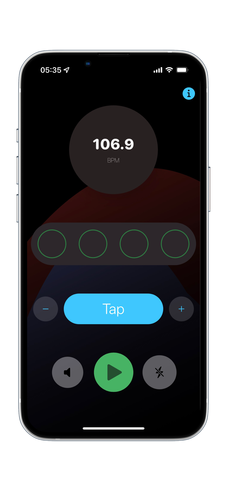

# Tempoist

Tempoist is a very simple to use, basic metronome.

Most metronomes, delay pedals, tremelo pedals, and the like have a feature called "Tap Tempo". This lets you interactively set the device's BPM by tapping, usually by pressing a footswitch repeatedly. In this case, you set the tempo by tapping on a button on the screen. You can also update the BPM by using the increment/decrement buttons.

There is a visual display of the beats, and you can optionally turn on the sound to hear a click track. If you're using an iPhone (not the simulator), you can turn on haptic feedback and you'll be able to feel vibrations on the beat.

## Building and running

Tempoist does not use any third party libraries, so all you need open the .xcodeproj file in a recent version of Xcode (Minimum deployment target is iOS 15.0) and update the signing configuration if you want to run it on your device.

## Contributing

Please feel free to file issues, start discussions, or make PRs.
